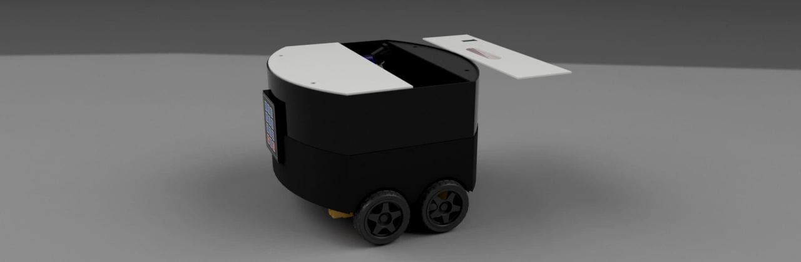
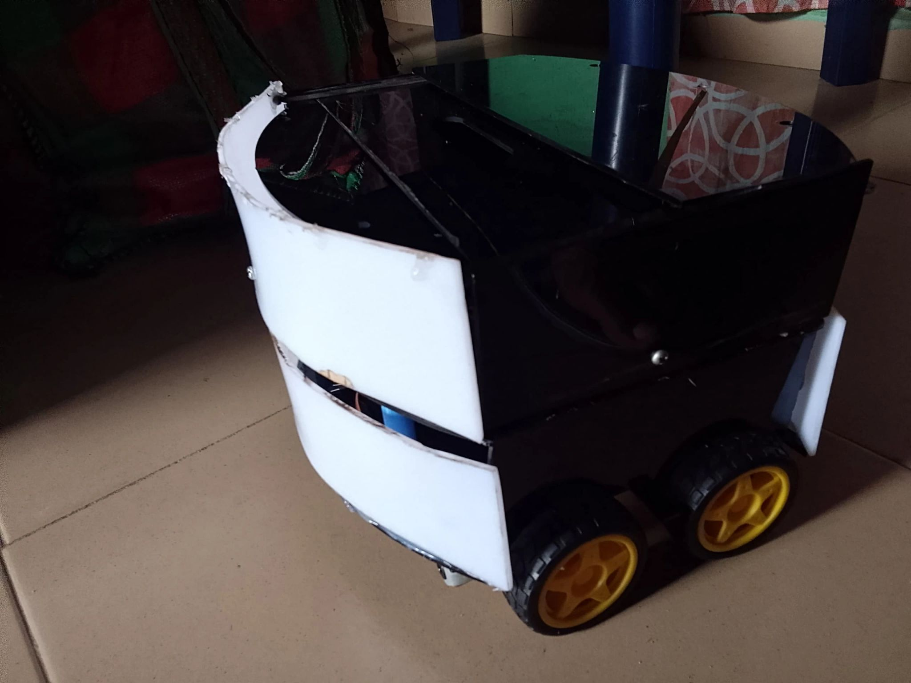
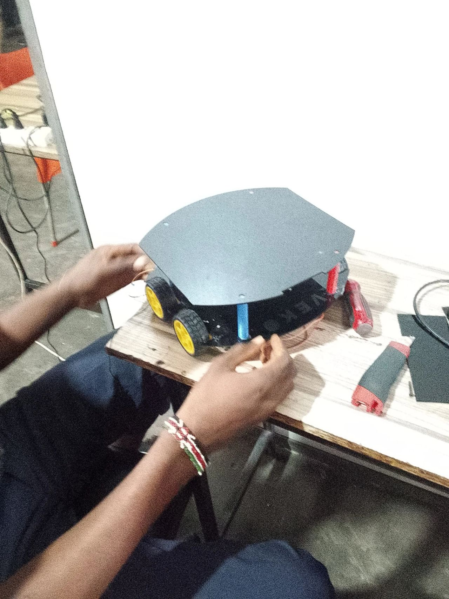
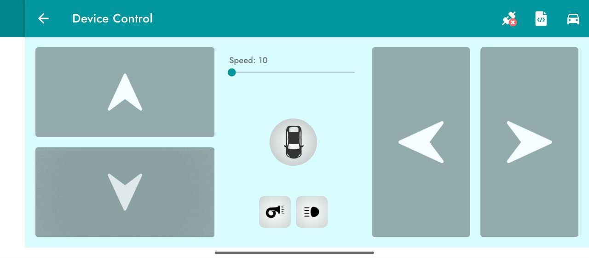

# VEKO — Delivery Robot  

**VEKO** is a small-scale delivery robot designed to transport light items (payload up to 1 kg) within an indoor workspace — ideal for shifting tools or small items between rooms without interrupting workflow.

##  Project Overview & Motivation  

At our workplace, we often found ourselves repeatedly walking between rooms just to deliver small tools or items (e.g. vernier calipers, rulers, screwdrivers, etc.). This constant back-and-forth broke concentration and decreased overall productivity.  

We envisioned a solution: a compact robot that can carry such items and deliver them to the right person/room — reducing downtime and making intra-office delivery seamless. That’s how VEKO was born.  

## 📦 What Problem It Solves  

- Eliminates frequent manual trips to deliver small tools or items across rooms  
- Minimizes interruptions and helps maintain focus and productivity  
- Provides a simple, easy-to-use internal delivery system without human effort  

## 🔧 What VEKO Does  

- Carries small payloads (up to 1 kg)  
- Has a locked carriage mechanism to secure items until delivered  
- Controlled remotely (via Bluetooth) rather than fully autonomous  

## ⚙️ Hardware & Components  

- Arduino uno Microcontroller  
- HC-05 Bluetooth module  
- Acrylic
- L293D IC (4-channel motor driver)  
- TT Wheels with  motors  
- NEO 6M GPS module

> ⚠️ Note: The NEO-6M GPS module was later removed from active use after it got damaged from incorrect powering (connected to 5V instead of 3.3–3.6V).  

## 🛠️ Challenges & Iterations  

- **Autonomy was too expensive** — LiDAR + Raspberry Pi + Camera setup for autonomous navigation was beyond budget.  
- **Poor hardware for vision-based autonomy** — An ESP32-CAM was considered, but its low resolution and limited compute made computer-vision impractical (high latency, possible overheating, poor results).  
- **GPS module failure** — The NEO-6M GPS module was damaged after being powered incorrectly (5V instead of 3.3–3.6V).  
- **Weight & torque miscalculation** — We underestimated the total weight (robot + payload), which caused the gears/motors to struggle.  

Because of these constraints, we shifted from a fully autonomous robot to a **manually-controlled delivery robot** — still useful, but simpler to build.

Despite the setbacks, VEKO is shaping up nicely after many lessons learned — and it's now a functional, remote-controlled delivery robot with locking carriage.  

## 📸 Gallery / Screenshots  

Here are some photos and renders of VEKO:  

  
  
  

## ▶️ Live Demo  

Check out the robot in action on YouTube:  
[VEKO — Delivery Robot Demo](https://youtu.be/70Sq2zyXl28)  

## 📥 How to Use / Control  

1. Turn on the robot and power up the arduino + Bluetooth module.  
  
3. Place the item to be delivered inside the carriage compartment, then lock it using the robot’s locking mechanism (enter the password if required).  
4. Send the robot to the target room/person.  
5. Recipient unlocks the carriage using the password to retrieve the item.  

## 🧰 What It’s Useful For  

- Internal delivery of tools or small objects within a building  
- Reducing repetitive walking — saves time and keeps workflow fluid  
- As a prototype for more advanced robotic delivery systems  

## 🔭 Future Improvements & What’s Next  

- Integrating autonomous navigation (using appropriate sensors + compute)  
- Upgrading the drive system (motors / torque / chassis) to handle heavier loads more reliably  
- upgrading control app for more, faster control features  
- redesigning the carriage compartment for better security, capacity, or modular attachments  
- Improving component selection and power-management to avoid issues like with the GPS module  

## 🙏 Acknowledgments / Credits  

Thanks to my partner [Vera](https://www.linkedin.com/in/vera-ijeoma-44790a2b0)  for collaborating and working through all the challenges with me. Also, thanks to whoever helped with building, testing, debugging, and moral support.  

## contributions

i'm actually open to contributions !!
